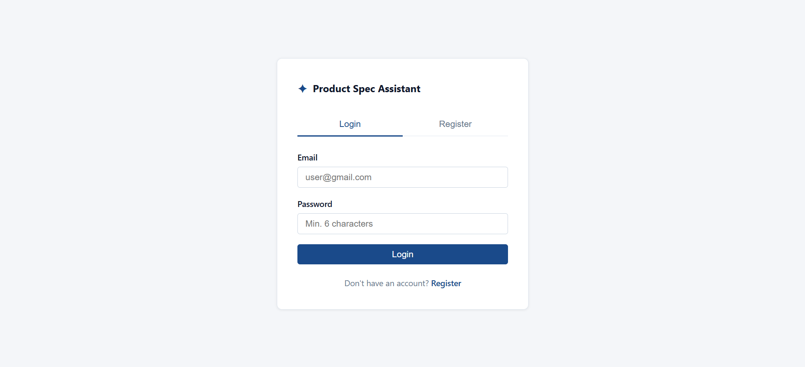
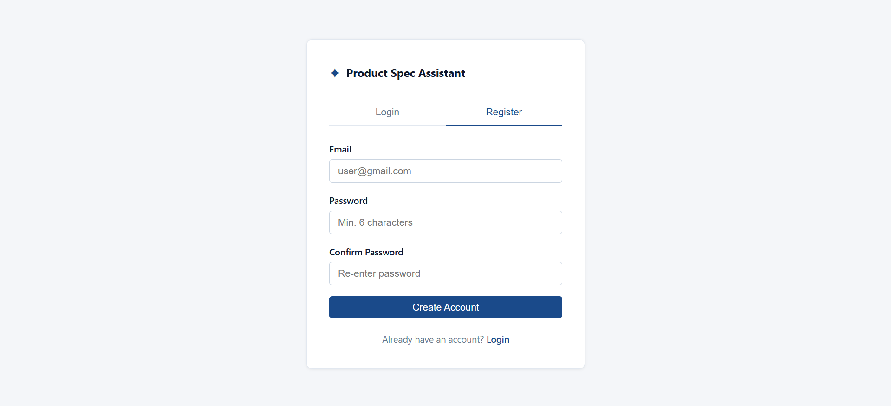
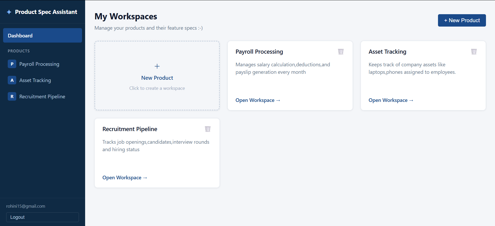
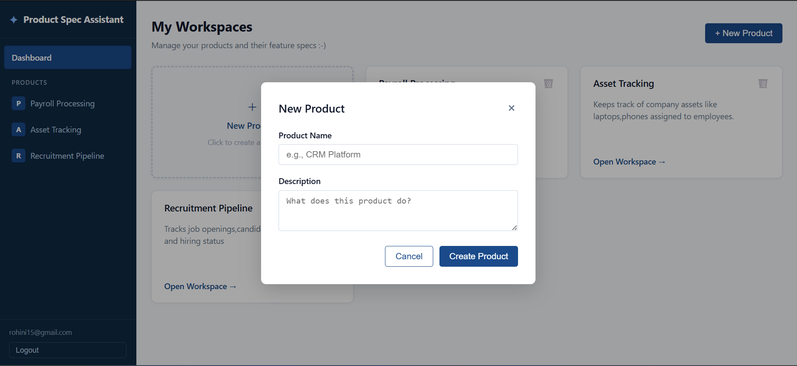

# Product Spec Assistant
 
A full-stack web app that helps product teams write and refine feature specifications using AI.
 
## Screenshots
 

 
## Tech Stack
- Angular 19
- ASP.NET Core Web API
- SQL Server
- Bcrypt.Net(Password Hashing)
- jsPDF/html2canvas(PDF Export)
 
## Features
 
- Register and login with hashed passwords
- Create and manage product workspaces
- Add features to each workspace
- Generate product specs from a raw idea using AI
- Refine specs with natural language instructions
- Every refinement is saved as a new version
- Export spec as PDF
 
## Getting Started
 
### Backend
cd backend/ProductSpecAssistant 
dotnet ef database update 
dotnet run
 
### Frontend
cd frontend 
npm install 
ng serve
 
Frontend runs at http://localhost:4200
Backend runs at https://localhost:7016
 
## Environment Setup
 
Copy `appsettings.example.json` to `appsettings.json` and fill in:
 
- `AI:ApiKey` - your HuggingFace API key
- `AI:ApiUrl` - your HuggingFace model URL
- `ConnectionStrings:DefaultConnection` - your database connection string
 
 
